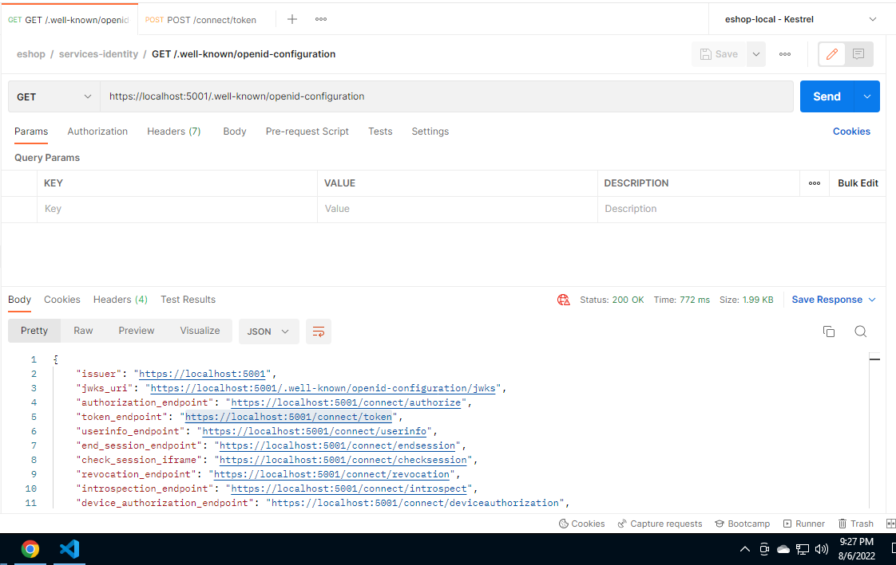
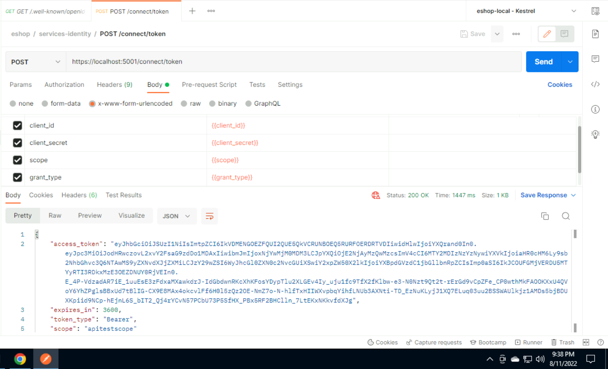
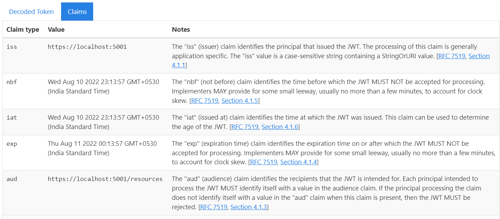
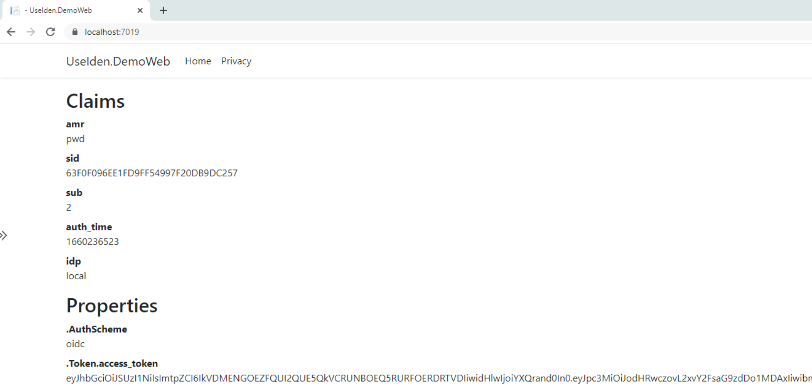

# eshop-services-identity

Identity Service for the eShop solution

## Retrieving Discovery Information

### Discovery Information using https://localhost:5001/.well-known/openid-configuration



## Retrieving Access Token

### Retrieving Access Token from Identity Service using Client Credentials Grant

```bash
POST /connect/token
CONTENT-TYPE application/x-www-form-urlencoded

    client_id=client1&
    client_secret=secret&
    grant_type=client_credentials&
    scope=scope1
```





## Web Application using Identity Service



```
dotnet new isempty -n IdentityServer.API

Template Name                                               Short Name  Language  Tags
----------------------------------------------------------  ----------  --------  ------------------
Duende BFF with JavaScript                                  bffjs       [C#]      Web/IdentityServer
Duende IdentityServer Empty                                 isempty     [C#]      Web/IdentityServer
Duende IdentityServer Quickstart UI (UI assets only)        isui        [C#]      Web/IdentityServer
Duende IdentityServer with ASP.NET Core Identity            isaspid     [C#]      Web/IdentityServer
Duende IdentityServer with Entity Framework Stores          isef        [C#]      Web/IdentityServer
Duende IdentityServer with In-Memory Stores and Test Users  isinmem     [C#]      Web/IdentityServer
```
