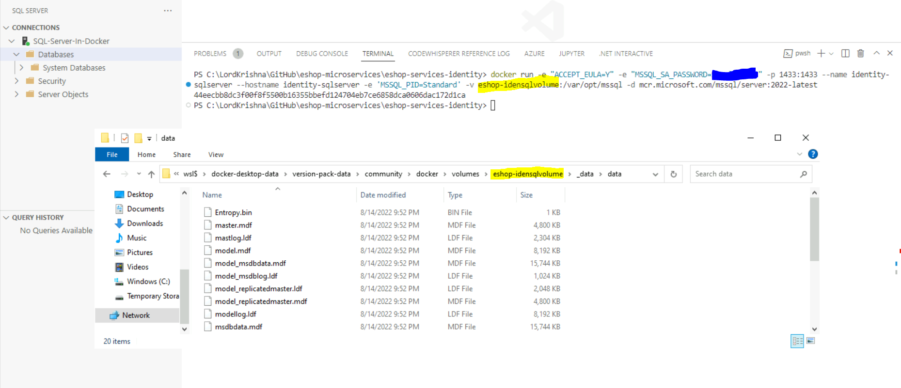
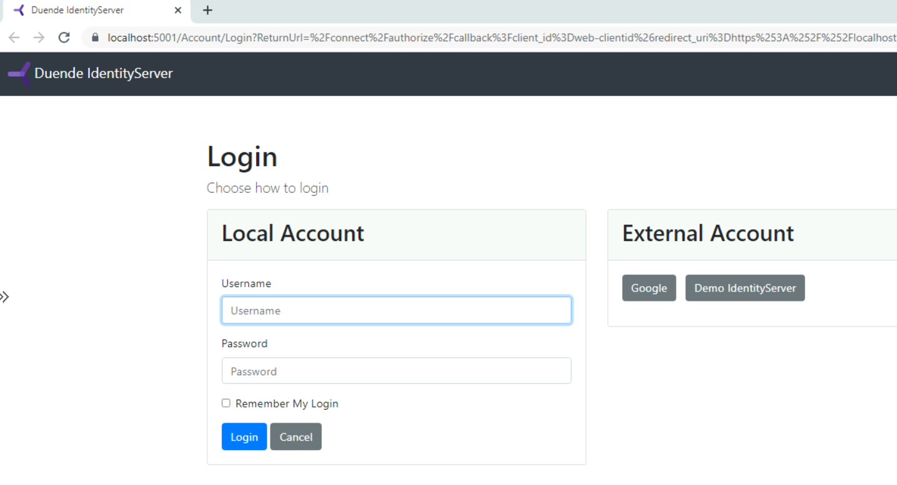
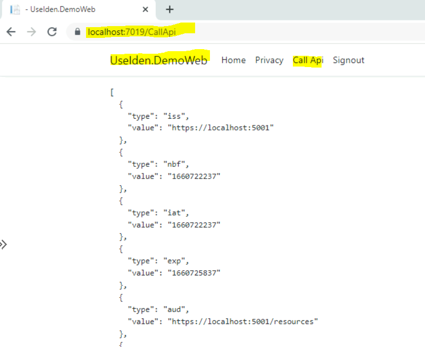
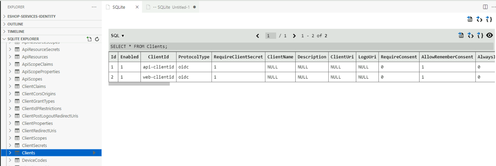

# eshop-services-identity micro service

Identity Service for the eShop solution

## Duende Identity Service

**Reference(s):**

> 1. [https://docs.duendesoftware.com/identityserver/v6/quickstarts/1_client_credentials](https://docs.duendesoftware.com/identityserver/v6/quickstarts/1_client_credentials)

```bash
dotnet new isempty -n IdentityServer.API

Template Name                                               Short Name  Language  Tags
----------------------------------------------------------  ----------  --------  ------------------
Duende BFF with JavaScript                                  bffjs       [C#]      Web/IdentityServer
Duende IdentityServer Empty                                 isempty     [C#]      Web/IdentityServer
Duende IdentityServer Quickstart UI (UI assets only)        isui        [C#]      Web/IdentityServer
Duende IdentityServer with ASP.NET Core Identity            isaspid     [C#]      Web/IdentityServer
Duende IdentityServer with Entity Framework Stores          isef        [C#]      Web/IdentityServer
Duende IdentityServer with In-Memory Stores and Test Users  isinmem     [C#]      Web/IdentityServer
```

```bash
dotnet ef migrations add CustomProfileData
dotnet run /seed
```

## Microsoft SQL Server in a Docker Container

**Reference(s):**

> 1. [https://docs.microsoft.com/en-us/sql/linux/sql-server-linux-docker-container-configure?view=sql-server-ver16&pivots=cs1-bash](https://docs.microsoft.com/en-us/sql/linux/sql-server-linux-docker-container-configure?view=sql-server-ver16&pivots=cs1-bash)

```bash
docker run -e "ACCEPT_EULA=Y" -e "MSSQL_SA_PASSWORD=YourStrongPassword@1" -p 1433:1433 --name identity-sqlserver --hostname identity-sqlserver -e 'MSSQL_PID=Standard' -v eshop-idensqlvolume:/var/opt/mssql -d mcr.microsoft.com/mssql/server:2022-latest
```

**Note:** SQL Server password policy requirements => least 8 characters long and contain characters from three of the following four sets: Uppercase letters, Lowercase letters, Base 10 digits, and Symbols.



## Retrieving Discovery Information

### Discovery Information using <https://localhost:5001/.well-known/openid-configuration>


## Retrieving Access Token

### Retrieving Access Token from Identity Service using Client Credentials Grant

```bash
POST /connect/token
CONTENT-TYPE application/x-www-form-urlencoded

    client_id=client1&
    client_secret=secret&
    grant_type=client_credentials&
    scope=scope1
```


## Web Application using Identity Service


## External Logins

**Two External Logins are configured:**


**External Login using Google**


## Web Application invoking protected Web API using Access Token

**Web Application invoking protected Web API using Access Token**


## SQLite as a Database Provider for Identity Service

**SQLite as a Database Provider for Identity Service**

